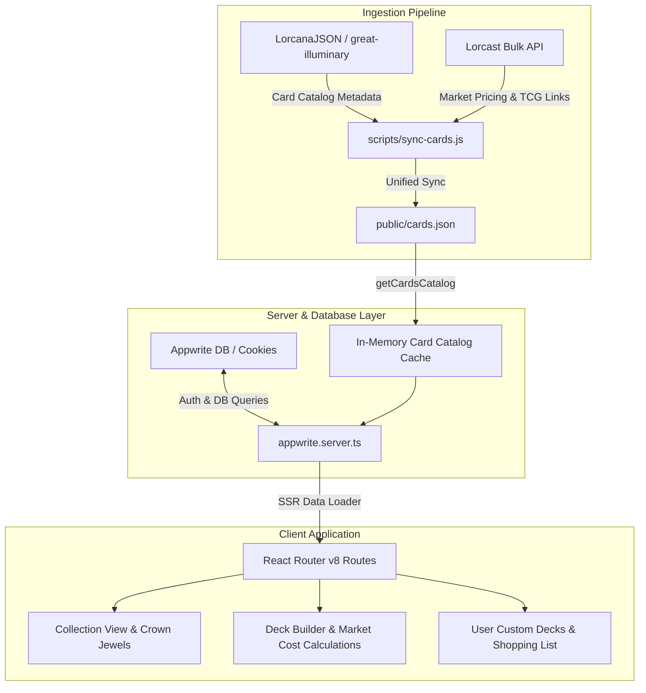
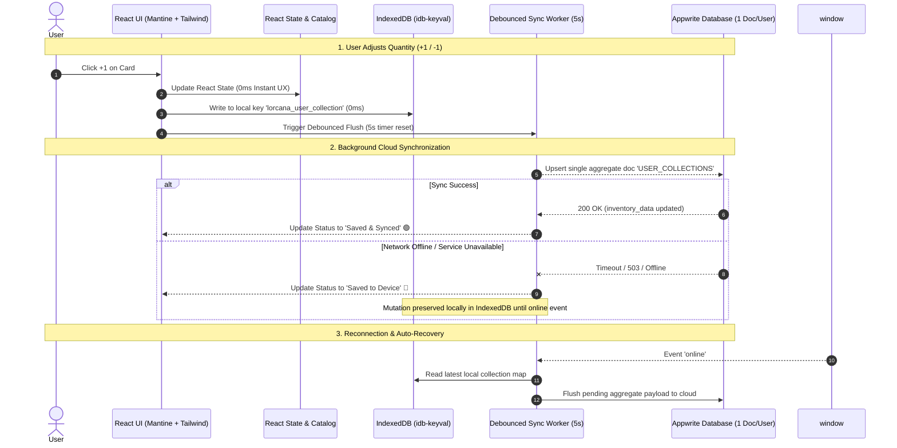

# System Architecture & Technical Overview

This document provides a technical overview of the Lorcana Tracker & Deck Builder application, covering the frontend architecture, backend services, data flow, and external integrations.

---

## 1. High-Level Architecture



---

## 2. Technology Stack

- **Framework:** React Router v8 (Framework Mode / SSR)
- **Language:** TypeScript
- **UI Components & Styling:** Mantine v9 (`@mantine/core`, `@mantine/hooks`), Tabler Icons (`@tabler/icons-react`), Tailwind CSS v4
- **Backend & Auth:** Appwrite (`node-appwrite` on server, `appwrite` web SDK on client)
- **Data Sources:** LorcanaJSON (`great-illuminary/lorcana-data`), `api-lorcana.com`, Ravensburger CDN
- **Testing:** Vitest, React Testing Library, jsdom

---

## 3. Directory Structure

```
├── app/
│   ├── components/         # Shared UI components (Navbar, AuthModal, etc.)
│   ├── constants/          # Card attributes, ink colors, franchises, sets
│   ├── routes/             # Route modules (collection, decks, my-decks, home)
│   │   ├── collection/     # Collection inventory management & filters
│   │   ├── decks/          # Trending & community decks with progress calculation
│   │   └── my-decks/       # User deck builder, deck import/export, and deck actions
│   ├── services/           # Server-side Appwrite & database service layer
│   ├── types/              # Domain models (Card, Deck, UserCollection, etc.)
│   └── utils/              # Calculation helpers (deck completion, inventory lookup)
├── docs/                   # Architecture & Data source documentation
├── public/                 # Static assets and synced cards catalog (cards.json)
└── scripts/                # Data synchronization scripts (sync-cards.js)
```

---

## 4. Key Workflows & Data Flows

### A. Card Data Synchronization (`sync:cards`)

1. **Fetch:** Pulls the complete card catalog from `https://lorcanajson.org/files/current/en/allCards.json`.
2. **Normalize:** Computes canonical card slugs (handling duplicates/promos), maps promo set names, formats classifications, and attaches official Ravensburger CDN image URLs.
3. **Persist:** Saves formatted cards into `public/cards.json`.
4. **Serve:** `appwrite.server.ts` loads this file into memory once upon startup, eliminating third-party card API latency and rate-limiting.

### B. Deck Progress Calculation

When a user views community decks or their own custom decks:

1. `getUserInventory(userId)` fetches the user's owned card quantities and foil statuses.
2. `getDecksWithProgress()` correlates required deck cards against the owned card inventory.
3. `calculateDeckProgress()` computes:
    - Total cards required vs. owned
    - Percentage of completion
    - List of missing cards with quantities needed
    - Estimated missing card cost / count

### C. Appwrite Database Layer & Local Fallback

- When configured, the app uses Appwrite for authentication sessions and document persistence (`user_collections`, `decks`, `deck_cards`).
- If unconfigured (`appwriteConfig.isConfigured === false`), the app smoothly operates with a local cookie-based fallback, allowing full development, offline usage, and isolated test execution.

---

## 5. Hybrid Local-First & Appwrite Synchronization Architecture



### Data Storage Specifications

1. **Client-Side Storage (`IndexedDB`):**
    - Key: `lorcana_user_collection`
    - Payload: `UserCollectionMap` (`Record<CardId, { normal: number; foil: number }>`)
2. **Cloud Storage (`Appwrite`):**
    - Collection: `user_collections` (1 aggregate document per user)
    - Attributes:
        - `user_id` (string)
        - `inventory_data` (JSON string of `UserCollectionMap`)
        - `updated_at` (ISO timestamp)
        - `version` (number)

### Debugging Guide for Local & Cloud State

- **Verifying Local Storage:** Open Browser DevTools → Application → IndexedDB → `keyval-store` → inspect `lorcana_user_collection`.
- **Verifying Cloud Document:** In Appwrite Console, navigate to `user_collections` and locate the document with `user_id = <userId>`. The `inventory_data` column contains the stringified JSON collection map.
- **Auto-Migration:** If a user accesses the app with legacy multi-row records (1 document per card row), `getUserInventoryAggregate()` automatically consolidates them into the single aggregate document format and deletes legacy rows in the background.

---

## 6. Additional Documentation

- See [`docs/DATA_SOURCES.md`](./DATA_SOURCES.md) for details on external APIs, CDN links, and third-party tools.
